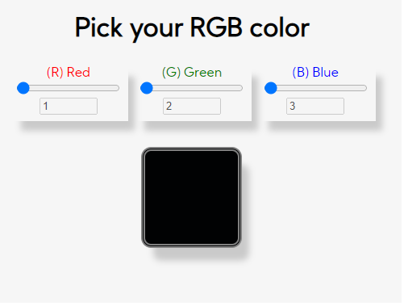

# Pick your RGB color

My frist JS project where you can set red, green and blue values and have your RGB color

### 🛠 What did I use:
- [JavaScript]
- [HTML5]
- [CSS3]

<h1 align="center">

</h1>

